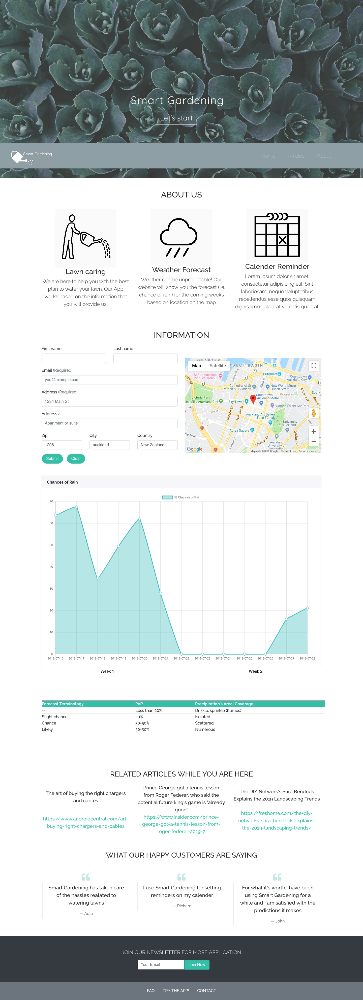

#Smart Gardening App:
Target audience: Homeowners
Solution: Provide the homeowners the best time to water their lawns
Issues to consider:  
-	 Water Conservation
-	Time Saving
-	Cost and Energy Optimization
This is a one page App trying to minimize the use of water, save time and money for the homeowners.

The app will receive user’s information such as name, address, email and cellphone number. The App will later check on the weather data forecast via “openweathermap API” to get meteorological data for that specific location. Then based on the acquired data the app will figure out through functions that whether the homeowner shall water their lawns in the next 7 days.
The app will present the weather data, the best time for water the lawn and the location on the google map (via google map API).

Project screenshot:

